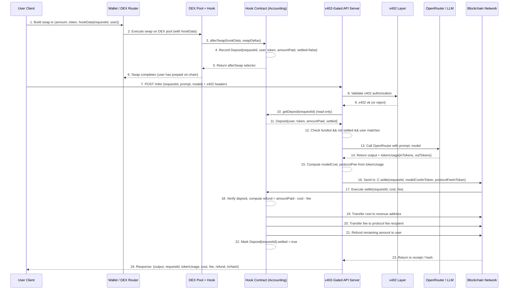

# x402-v4Hook Implementation Plan

## 1. High-Level Architecture

This system implements a pay-per-use AI inference service gated by on-chain liquidity using Uniswap V4 Hooks.

### Components

1.  **User Client**
    *   Wallet + front-end (CLI, web, mobile, etc.)
    *   Can sign txs and call HTTP APIs.

2.  **DEX Pool with Hook**
    *   A liquidity pool (e.g. USDC/ETH/UtilityToken) that supports **hooks**.
    *   **Hook Contract** attached to this pool:
        *   Records **per-request deposits** keyed by `requestId`.
        *   Exposes read method: `verify(requestId)` or `getDeposit(requestId)`.
        *   Exposes write method: `settle(requestId, actualCost, protocolFee)`.

3.  **On-chain Tokens**
    *   Payment tokens (e.g. USDC, ETH, or others).
    *   Possibly a separate “usage token”, but not required.

4.  **x402-Gated API Server**
    *   Single server combining:
        *   **Facilitator role**: validates x402 access + interacts with the hook contract.
        *   **Resource role**: runs inference by calling **OpenRouter** (or any LLM provider).
    *   Exposes **one primary endpoint**, e.g. `POST /infer`.

5.  **OpenRouter / LLM Provider**
    *   External HTTP API.
    *   Returns:
        *   Model output.
        *   Token usage / billing metadata (input + output tokens, etc.).

6.  **Blockchain Network**
    *   Executes swaps and settlements.
    *   Stores deposits and refund state inside the hook contract.

---

## 2. Step-by-Step Architecture (Flow)

### Step 0 – Generate a `requestId`
*   The client generates a unique `requestId` (off-chain):
    *   e.g. `hash(userAddress, nonce, timestamp)`.

### Step 1 – User funds the request via DEX (+ hook)
**Goal:** lock some amount of USDC/ETH on-chain for this `requestId`.

1.  Client prepares a **swap transaction**:
    *   Selects **payment token** (e.g. USDC or ETH).
    *   Specifies **amount user is willing to prepay** (upper bound).
    *   Encodes `requestId` (and optionally `userAddress`) into `hookData`.
2.  Client sends swap tx to DEX router / pool manager.
3.  DEX executes the swap.
4.  **Hook contract’s `afterSwap`** is invoked automatically:
    *   Reads `hookData` → gets `requestId`, `userAddress`.
    *   Reads swap deltas to determine **actual amount paid**.
    *   Stores a `Deposit` record:
        *   `requestId`
        *   `userAddress`
        *   `token` (USDC/ETH/…)
        *   `amountPaid`
        *   `settled = false`.

### Step 2 – User calls the x402-gated API
**Goal:** start an inference only if on-chain funding exists.

1.  Client calls `POST /infer` on the **x402-gated API**, with:
    *   `requestId`
    *   prompt / input payload
    *   optional model / parameters.
2.  x402 layer **authenticates & authorizes** the call:
    *   Checks the caller’s x402 credentials.
    *   Ensures they are allowed to access this resource.

### Step 3 – Server verifies funding on-chain
**Goal:** don’t run inference unless user prepaid.

1.  API server calls the **hook contract (read-only)**:
    *   e.g. `getDeposit(requestId)`.
2.  Server validates:
    *   `deposit.user == caller` (or matches a mapping derived from x402 identity).
    *   `deposit.amountPaid > 0`.
    *   `deposit.settled == false`.
3.  If verification fails → server returns an error (e.g. “not funded / expired”).

### Step 4 – Server runs inference via OpenRouter
**Goal:** run the actual model and learn how many tokens were used.

1.  Server sends request to **OpenRouter** (or other provider):
    *   Includes model name and prompt/content.
    *   Adds any metadata needed to correlate with `requestId`.
2.  OpenRouter executes the model and returns:
    *   Generated text (or image, etc.).
    *   **Token usage metrics**:
        *   `input_tokens`
        *   `output_tokens`
        *   Possibly per-token cost or total cost.
3.  Server **computes actual cost**:
    *   Based on pricing schedule: e.g. `cost = input_tokens * price_in + output_tokens * price_out`.
    *   **Protocol fee**: e.g. `fee = cost * feeRate`.

### Step 5 – Server settles with hook contract
**Goal:** translate real cost to payment in the chosen token, refund the difference.

1.  Server converts **actual cost + protocol fee** to **token units**:
    *   If payment is in USDC and cost is in USD → 1:1.
    *   If in ETH or other tokens → use some pricing source (TWAP, oracle, or off-chain conversion).
2.  Server sends a **settlement transaction** to the hook contract:
    *   Calls `settle(requestId, modelCostInToken, protocolFeeInToken)`.
3.  On-chain, the **hook contract**:
    *   Looks up `Deposit` for `requestId`.
    *   Ensures it’s not already settled.
    *   Validates that `modelCost + protocolFee ≤ amountPaid`.
    *   Computes `refund = amountPaid - (modelCost + protocolFee)`.
    *   Transfers:
        *   `modelCost` to the **resource / protocol revenue address**.
        *   `protocolFee` to a **fee recipient**.
        *   `refund` back to the **user**.
    *   Marks `settled = true`.

### Step 6 – Server returns response to user
**Goal:** give user both the **model output** and a clear **billing summary**.

1.  After broadcasting (or confirming) the settlement tx, server responds to `/infer` with:
    *   Model output (text / image URL / etc.).
    *   `requestId`.
    *   `input_tokens`, `output_tokens`.
    *   `actualCost`, `protocolFee`, `refund`.
    *   Settlement tx hash (if applicable).
2.  The client can:
    *   Display the model response.
    *   Optionally link to the settlement transaction on a block explorer.
    *   Show the **exact amount paid vs refunded**, proving the “pay-per-actual-usage” behavior.

### Step 7 – Optional: Multi-token support (future extension)
*   Hook contract supports **multiple payment tokens**.
*   Each `Deposit` records which token was used.
*   Server’s **pricing logic**:
    *   Converts model cost (denominated in e.g. USD) to the corresponding token amount using a chosen oracle or DEX quote.
*   `settle()` stays the same, only amounts differ.

---

## 3. Sequence Diagram

