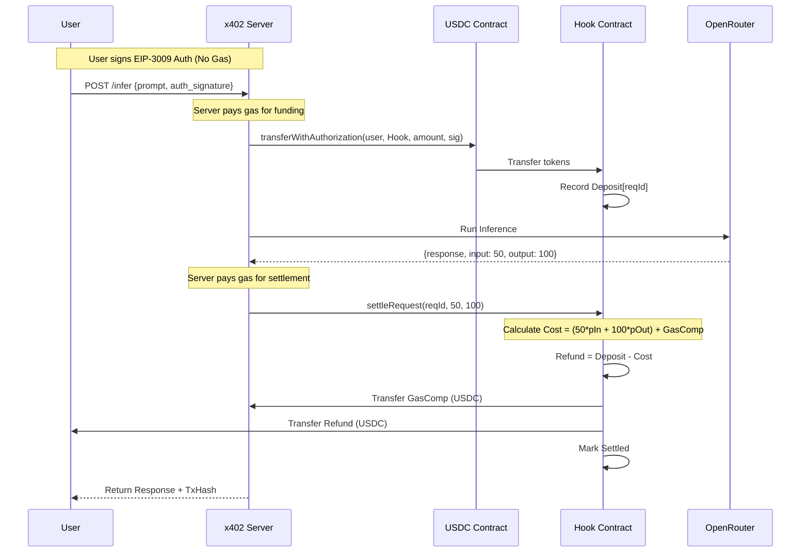

# x402-v4Hook Implementation Plan

## 1. High-Level Architecture

This system implements a pay-per-use AI inference service gated by on-chain liquidity using **EIP-3009 (Gas-Abstracted Deposits)** and **Uniswap V4 Hooks** for dynamic pricing.

### Components

1.  **User Client**
    *   Wallet + front-end.
    *   Signs **EIP-3009** authorizations to fund requests (no gas paid by user).
    *   Calls the x402 API.

2.  **Hook Contract (Settlement & Pricing)**
    *   **Role 1: Payment & Settlement**
        *   Receives EIP-3009 transfers (`receiveWithAuthorization` / `transferWithAuthorization`).
        *   Holds user deposits keyed by `requestId`.
        *   Settles charges based on `tokensUsed` (input/output).
        *   Refunds unused funds to user.
        *   **Economically reimburses gas** to the facilitator.
    *   **Role 2: Uniswap V4 Hook**
        *   Attached to a pool (e.g. USDC/$Atrium).
        *   Updates global `PricingParams` (price per token, surge factors) based on pool activity (volatility, demand).

3.  **x402 Resource Server (Facilitator)**
    *   **Gas Payer**: Submits EIP-3009 txs and Settlement txs to chain.
    *   **Inference Relay**: Calls OpenRouter/LLM.
    *   **Trusted Reporter**: Reports `input_tokens` and `output_tokens` to the hook for settlement.

4.  **OpenRouter / LLM Provider**
    *   Off-chain inference engine.
    *   Source of truth for token usage counts.

---

## 2. Step-by-Step Architecture (Flow)

### Step 0 – User Intent & Authorization
*   User wants to run an inference.
*   User signs an **EIP-3009 Authorization**:
    *   `from`: User
    *   `to`: Hook Contract
    *   `value`: Max Budget (e.g., 10 USDC)
    *   `validBefore`, `nonce`, etc.
*   User sends this **signature** + `prompt` to the x402 Server (via HTTP).
*   **User pays NO GAS.**

### Step 1 – Server Funds the Request (On-Chain)
**Goal:** Lock user funds in the Hook contract using the signature.

1.  Server receives request + signature.
2.  Server submits transaction to Token Contract (e.g., USDC):
    *   `USDC.transferWithAuthorization(..., to=Hook, value=MaxBudget, ...)`
3.  **Hook Logic**:
    *   Hook receives tokens.
    *   Records `deposits[requestId] = { user, amount, settled=false }`.
4.  Server pays the gas for this tx (will be reimbursed later).

### Step 2 – Inference (Off-Chain)
**Goal:** Get the actual cost.

1.  Server calls OpenRouter with user's prompt.
2.  OpenRouter returns:
    *   Response content.
    *   `input_tokens`: 50
    *   `output_tokens`: 120
3.  Server calculates it needs to report these numbers to the chain.

### Step 3 – Settlement & Refund (On-Chain)
**Goal:** Charge for exact usage, reimburse gas, refund remainder.

1.  Server calls `Hook.settleRequest(requestId, inputTokens, outputTokens)`.
2.  **Hook Logic**:
    *   **Dynamic Pricing**: Reads current `pricing` struct (updated via Uniswap hooks).
        *   `baseCost = (input * priceIn) + (output * priceOut)`
    *   **Gas Compensation**: Reads `pricing.gasMarkup` or calculated fee.
    *   **Protocol Fee**: Calculates percentage fee.
    *   **Total Charge**: `total = baseCost + gasComp + fee`.
    *   **Validation**: Ensure `total <= deposit.amount`.
    *   **Transfers**:
        *   `baseCost` -> LLM Treasury.
        *   `gasComp` -> Facilitator (Server) to cover gas.
        *   `fee` -> Protocol Treasury.
        *   `Refund (deposit - total)` -> User.
    *   **State**: Marks `requestId` as settled.

### Step 4 – Response
1.  Server returns model output + transaction hash of settlement to User.
2.  User verifies on-chain that they were refunded the difference.

---

## 3. Dynamic Pricing Strategy (Uniswap V4 Integration)

The Hook contract is also a Uniswap V4 Hook.

*   **Trigger**: `afterSwap` on the reference pool.
*   **Logic**:
    *   Observe pool state (tick, volatility, volume).
    *   Update `PricingParams` in the Hook contract.
    *   *Example*: High volatility in the pool -> Increase `pricePerToken` or `surgeFactor` for future inference requests.

---

## 4. Data Structures

```solidity
struct Deposit {
    address user;
    address token;
    uint256 amountPaid;
    bool settled;
}

struct PricingParams {
    uint256 pricePerInputToken;
    uint256 pricePerOutputToken;
    uint256 protocolFeeBps;
    uint256 gasMarkupPerCall;
}
```

## 5. Sequence Diagram


